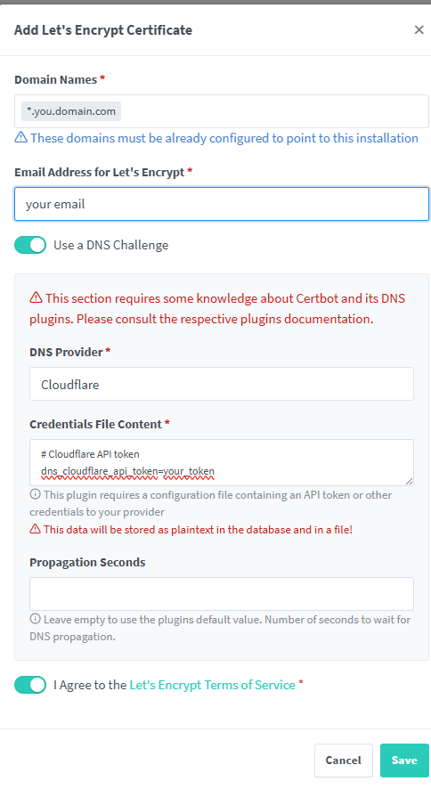
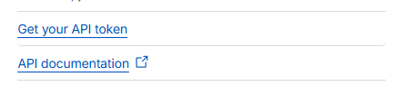
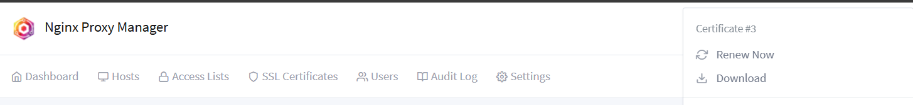

# On-Premise Infrastructure

# Getting started

To make it easy for you to get started with this project, here's a list of recommended next steps.

# Contents
- [Dependencies](#dependencies)
- [Installation](#installation)

## Dependencies
### Make sure to install [Tailscale](https://tailscale.com/download) on all VM (Machine)
Tailscale will make your IP permanently event if you restart the machine.

## Installation
Feel free to follow my instructions to install these:
1. Install your cluster (1 master, 3 workers). Then install ingress-controller.
2. Install LoadBalancer using nginx
3. Install Nginx Proxy Manager with docker-compose (on your VPS or VPC) to simplify reverse proxy configuration and secure web traffic with SSL
4. Configure CloudFare.
    - Create or Buy your own domain
    - Get the Public IP of VPC or VPS that hosts your NPM
    - Configure Records DNS for all services in cluster(s)
    - Point Your Domain Record Name to Public IP of NPM
    - Access your NPM, Add SSL Certificate using Cloudflare API
        1. Click on SSL Certificates

            
        2. Select Add SSL Certificates
        3. Set up your ssl with *.your.domain.com

            
        4. Get Your CloudFlare Token from:

            
5. Then create Proxy Host to fit your requirement. For example:
    - Scheme: The scheme that NPM will use when forwarding (reversing) traffic to your target server (http/https). If your target using http, then scheme should be http. If using https, make sure to download the cert and create secret tls for your target server:

        
    - SSL: Use *.bbtech.io.vn that you create before:

        
6. Install your own Jenkins and use my jenkins-shared-lib
7. Install Harbor Registry (on k3s) for storing images
8. Install Rancher (using docker-compose)
9. Install Central ArgoCD on dedicated machine(on minikube) or VM
10. Install SonarQube for code quality analysis
11. Install Central Prometheus
12. Install Node-Exporter to VM you want
13. Install cluster Elasticsearch
14. Install Fluent-Bit on Cluster for centralized collection and forwarding
15. Install Kibana to visualize and explore logs collected from the cluster
16. Install Central Grafana to visualize metrics from Central Prometheus.