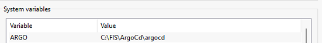
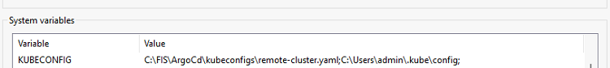

# ArgoCD Central

# Getting started

To make it easy for you to get started with this project, here's a list of recommended next steps.

# Contents
- [Why?](#why)
- [Installation](#installation)
- [Dependencies](#dependencies)
- [Usage](#usage)

## Why?
Many Organizations often operate multiple Kubernetes clusters - across regions, environments (dev, staging, prod), or even hybrid infrastructures (on-prem or cloud). Managing application deployments across all of them manually quickly becomes complex, error prone, and inconsistent.

**That's where Argo CD Central shines.**

- **Centralized GitOps Control**: ArgoCD Central provides a single control plane to manage application deployments across many clusters, all driven by Git repositories as the source of truth. Instead of configuring each argocd for each cluster separately, you declare desired states in GIT - and ArgoCD central automatically synchronizes every cluster to match those states.

- **Unified Visibility and Management**: From one ArgoCD dashboard, you can:
    - Monitor the health and sync status of all clusters and applications.
    - Quickly identify drifts or failures
    - Rollback or -re-deploy with on click
This unified view replaces scattered dashboards and CLI scripts, making operations both transparent and auditable.

- **Consistent GitOps Workflows**: No matter where your clusters live - AWS EKS, GKE, AKS, on-prem, or edge - the same GitOps workflow applies:
    1. Push application manifests or Helm charts to Git.
    2. Argocd Central detects the change (make sure you configure your ArgoCD repository with right permission(ssh or https)).
    3. It syncs and deploys to the target clusters, projects automatically.

## Installation
The following set up is for minikube running on Docker Desktop Window.

- Make sure to install Helm on your minikube, if not run this command for install Helm on Terminal [Window](https://helm.sh/docs/intro/install/)
    ```
    winget install Helm.Helm
    ```
    Adding ArgoCd repo for helm
    ```
    helm repo add argo https://argoproj.github.io/argo-helm
    helm repo update
    ```
- To Expose your ArgoCD to outside cluster, create the values.yaml to change the service type of your Argocd to NodePort:
    ```
    server:
    service:
        type: NodePort
        nodePortHttp: 30080 (change this, if it is already in used)
        nodePortHttps: 30443 (change this, if it is already in used)
    ```
- Install Your ArgoCD Central with values.yaml file you have created
    ```
    helm install argocd argo/argo-cd -f values.yaml -n argocd --create-namespace
    ```

- Install [ArgoCD CLI](https://kostis-argo-cd.readthedocs.io/en/refresh-docs/getting_started/install_cli/) to add clusters to your ArgoCD. See More at [ArgoCD Document](https://argo-cd.readthedocs.io/en/stable/cli_installation/#windows)
    ```
    # For window
    # Make sure create the folder and move to it for installation
    mkdir argocd
    cd argocd
    curl -sSL -o argocd.exe https://github.com/argoproj/argo-cd/releases/latest/download/argocd-windows-amd64.exe
    ```
- If you installed success, argocd.exe will be in your argocd folder. Then you have to add the argocd folder path to ENVIRONMENT.

    

- Then add it to Path

    

- To manage many clusters, you need to create remote-cluster.yaml to store contexts of those clusters.
```
# Create folder kubeconfigs
mkdir kubeconfigs
cd kubeconfigs
# Get your local cluster context using
kubectl config view --raw
# Copy it to your remote-cluster.yaml
# SSH to your master node of cluster(s) to get the config with these command:
cat ~/.kube/config

# Copy the output and merge it to remote-cluster.yaml. Feel free to name the cluster, users, context but make sure all of that are consistent. Then your remote-cluster.yaml will have structure like this:
apiVersion: v1
clusters:
- cluster:
    certificate-authority-data: ""
    server: https://kubernetes.docker.internal:6443
  name: docker-desktop <- your local context cluster
- cluster:
    certificate-authority-data: ""
    server: https://x.x.x.x:6443
  name: kubernetes <- your remote context cluster1
- cluster:
    certificate-authority-data: ""
    server: https://x.x.x.x:6443
  name: kubernetes-2 <- your remote context cluster1
contexts:
- context:
    cluster: docker-desktop
    user: docker-desktop
  name: docker-desktop
- context:
    cluster: kubernetes
    namespace: interpay-dev
    user: kubernetes-admin
  name: kubernetes-admin@kubernetes
- context:
    cluster: kubernetes-2
    user: kubernetes-admin-2
  name: kubernetes-admin-2@kubernetes-2
current-context: docker-desktop
kind: Config
users:
- name: docker-desktop
  user:
    client-certificate-data: ""
    client-key-data: ""
- name: kubernetes-admin
  user:
    client-certificate-data: ""
    client-key-data: ""
- name: kubernetes-admin-2
  user:
    client-certificate-data: ""
    client-key-data: ""
```

- Create KUBECONFIG System Variables with the path to remote-cluster.yaml


- Login to your ArgoCD Central for add new clusters
```
argocd login <ARGOCD_SERVER> --username admin --password <PASSWORD>
```
- Adding your cluster to Argocd Central
```
# get the context name of cluster your want to add
kubectl config get-contexts

# Add cluster to argocd
argocd cluster add <YOUR_REMOTE_CLUSTER_CONTEXT>
example: argocd cluster add kubernetes-admin@kubernetes

# If you want remove cluster, make sure:
argocd cluster rm kubernetes-admin@kubernetes
# Then go to remote cluster and delelte resources: 
kubectl delete serviceaccount argocd-manager -n kube-system
kubectl delete clusterrole argocd-manager-role
kubectl delete clusterrolebinding argocd-manager-role-binding
kubectl delete secret argocd-manager-long-lived-token -n kube-system
```