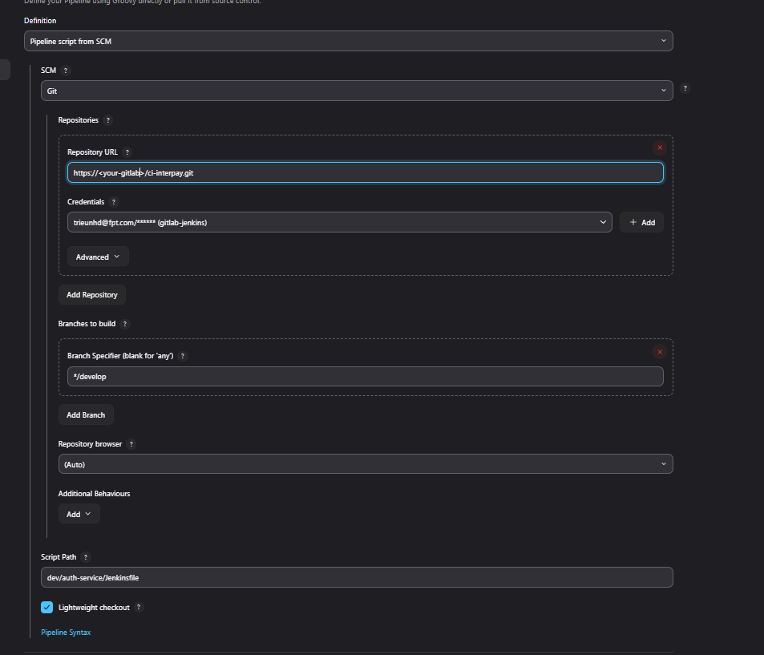

# jenkins Continuos Integration Repository (CI repo)

# Getting started

# Contents
- [Why?](#why)
- [Project Structure](#project-structure)
- [Installation](#installation)
- [Usage](#usage)

## Why?
I wanted a Continuos Integration Repository that allow you to:
- Centralize and standardize CI logic across multiple projects, eliminating duplicated or inconsistent Jenkins pipelines.
- Enforce best practices by providing pre-defined build, test, and deploy stages that teams can easily reuse.
- Accelerate onboarding for new projects by reducing the need to write Jenkinsfiles from scratch - simply import the shared library and call ready-to-use pipelines with specific arguments

## Project Structure
```
ci-repository/
├── dev/                    # The environment that the services will be deployment on
│   ├── auth-service/       # Jenkinsfile for Auth Service
│   ├── esb-service/        # Jenkinsfile for Esb Service
│   ├── fee-service/        # Jenkinsfile for Fee Service
│   ├── lc-service/         # Jenkinsfile for Lc Service
│   └── webapp/             # Jenkinsfile for Webapp Service
│
├── prod/                   # The environment that the services will be deployment on ( create more if you want)
│   ├── auth-service/       # Jenkinsfile for Auth Service
│   ├── esb-service/        # Jenkinsfile for Esb Service
│   ├── fee-service/        # Jenkinsfile for Fee Service
│   ├── lc-service/         # Jenkinsfile for Lc Service
│   └── webapp/             # Jenkinsfile for Webapp Service
│
└── README.md               # Project documentation
```
## Installation
### Clone jenkins-shared-lib project
- [ ] [Access source of this project](https://docs.gitlab.com/ee/user/project/repository/web_editor.html#create-a-file)

```
cd to_your_local_repo
git clone https://<your-gitlab>/ci-repository.git
git checkout develop
git pull
```

## Usage
**Set up the pipeline to SCM from Git**
