# jenkins-shared-lib

# Getting started

To make it easy for you to get started with this project, here's a list of recommended next steps.

# Contents
- [Why?](#why)
- [Project Structure](#project-structure)
- [Installation](#installation)
- [Code and Folder Breakdown](#code-and-folder-breakdown)
  - [src](#src)
  - [resources](#resources)
  - [vars](#vars)
- [Dependencies](#dependencies)
- [Usage](#usage)


## Why?
I wanted a shared library that allow you to:
- Eliminate **repetitive and inconsistent steps** in Jenkinsfile that can lead to errors
- Provide **reusable functions** to simplify and reduce manual effort when setting up Jenkinsfiles across different deployment environments.
- Ensure a **consistent and maintainable CI/CD flow** that can be **easily reused** across multiple projects

## Project Structure
```
JENKINS-SHARED-LIB/
├── jenkins-interpay-lib-main/          # Main shared library folder. Create More if you refer
│   ├── resources/                      # Resource files (e.g., templates, config)
│   └── src/                            # Source code for pipeline logic
│       ├── build/                      # Build logic (using docker to build images)
│       ├── deploy/                     # Deployment logic (Using Argocd)
│       ├── jenkins/                    # Jenkins abstraction that manage stage execution and pipeline behavior
│       ├── pipeline/                   # Pipeline definitions(CI/CD)
│       ├── repository/                 # Repository handling scripts
│       └── vcs/                        # Version control helpers
│       └── quality/                    # Code quality and analysis tools (e.g., SonarQube configuration)
│
├── vars/                               # Global variables (Groovy scripts callable in Jenkinsfiles)
│   ├── conf.groovy                     # Configuration-related functions
│   └── utils.groovy                    # Utility functions (common reusable code)
│
└── README.md                           # Project documentation
```

## Installation
### Clone jenkins-shared-lib project
- [ ] [Access source of this project](https://docs.gitlab.com/ee/user/project/repository/web_editor.html#create-a-file)

```
cd to_your_local_repo
git clone https://gitlab.fis.vn/bnkhcm.sw3/new-workflow/nonprod-cicd/jenkins-shared-lib.git
git checkout develop
git pull
```
### Make sure you have the Jenkins to import this jenkins-shared-lib as global
#### If not have Jenkins, follow these steps to install on Linux Ubuntu:
- Install java
```
sudo apt update
sudo apt install fontconfig openjdk-21-jre
java --version
```
- Using Long Term Support release
```
sudo wget -O /etc/apt/keyrings/jenkins-keyring.asc \
  https://pkg.jenkins.io/debian-stable/jenkins.io-2023.key
echo "deb [signed-by=/etc/apt/keyrings/jenkins-keyring.asc]" \
  https://pkg.jenkins.io/debian-stable binary/ | sudo tee \
  /etc/apt/sources.list.d/jenkins.list > /dev/null
sudo apt update
sudo apt install jenkins
```
- The package installation will:
    - Setup Jenkins as a daemon launched on start. Run systemctl cat jenkins for more details
    - Create a 'jenkins' user to run this service. You can use this command to check jenkins user:
    ```
    cat /etc/passwd | grep jenkins
    ```
    - Direct console log output to systemd-journald. Run journalctl -u jenkins.service if you are troubleshooting Jenkins.
    - Populate /lib/systemd/system/jenkins.service with configuration parameters for the launch, e.g JENKINS_HOME
    - Set Jenkins to listen on port 8080. Access this port with your browser to start configuration. If the Jenkins fails to run because a port is in use, run **systemctl edit jenkins** and update Environment:
    ```
    [Service]
    Environment="JENKINS_PORT=8081"
    ```
### Java Versions Set UP
- Make sure to install all java version that your applications need(JDK 17, JDK 21). The java paths will be set to Jenkins tool for building project and implementing Sonar scanning using Scanner CLI.
- For example of setting Path to your Jenkins JDK tools:
    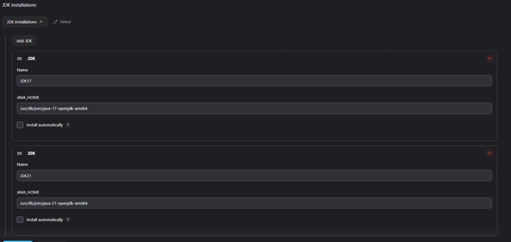

### Install Scanner CLI on Jenkins ( or Jenkins Agent )
Getting the latest version at this [sonar-scanner-cli](https://github.com/SonarSource/sonar-scanner-cli/releases).
- Install Sonar Scanner CLI
```
wget https://binaries.sonarsource.com/Distribution/sonar-scanner-cli/sonar-scanner-cli-7.0.1.4817-linux-x64.zip
unzip sonar-scanner-cli-7.0.1.4817-linux-x64.zip
# Move the extracted directory to /opt/sonarscanner
sudo mv sonar-scanner-7.0.1.4817-linux-x64/  /opt/sonarscanner
# Enable execute permissions on the sonar-scanner binary
sudo chmod +x /opt/sonarscanner/bin/sonar-scanner
# Link the sonar-scanner binary to the /usr/local/bin directory to enable it as a system-wide command
sudo ln -s /opt/sonarscanner/bin/sonar-scanner /usr/local/bin/sonar-scanner
# View the installed SonarScanner version
sonar-scanner -v
```
- Install SonarQube Plugins on Jenkins
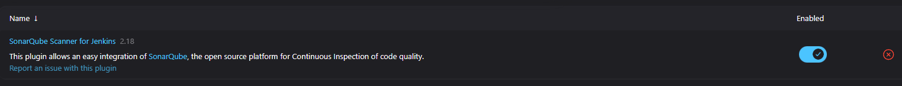
- Set up SonarQube Server on Jenkins Settings
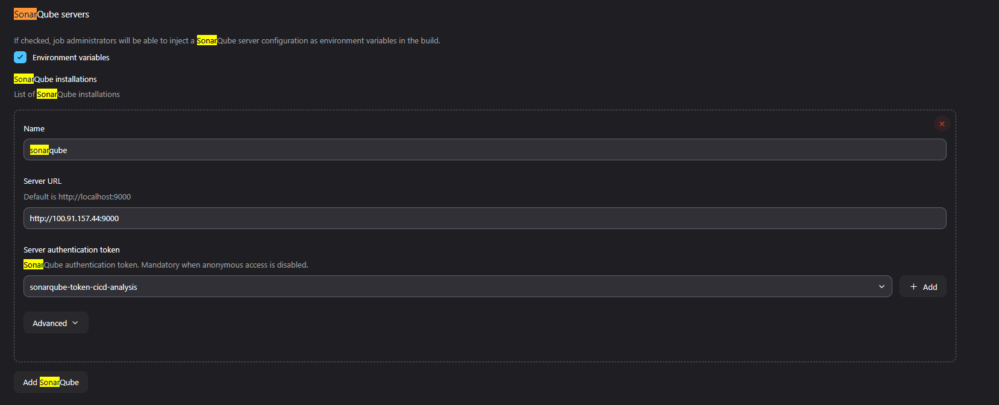
### Setting Global Trusted Pipeline Libraries
- In Your Jenkins navigate to Dashboard -> Manage Jenkins -> System.
- Scrolling down to **Global Trusted Pipeline Libraries**
- Set up fields in this section
    - Name: The name of the library (Example: jenkins-interpay-lib-main)
    - Default version: The branch of the Git/Gitlab source (e.g., develop)
    - Retrieval method: Modern SCM
    - Source Code Management: Git
    - Project Repository: https://gitlab.fis.vn/bnkhcm.sw3/new-workflow/nonprod-cicd/jenkins-shared-lib.git (Replace it to your own lib)
    - Credentials: The Jenkins credentials ID used to connect to Git or GitLab
    - Library Path: jenkins-interpay-lib-main (It must exactly map the name of folder that contains your library code)

### Setting ArgoCD CLI in Jenkins Server for CD
- Download the argocd CLI, making it available system-wide for all users (Jenkins user need this to run)
```
sudo curl -sSL -o /usr/local/bin/argocd https://github.com/argoproj/argo-cd/releases/latest/download/argocd-linux-amd64
sudo chmod +x /usr/local/bin/argocd
```
- Verify install successfully
```
argocd version --client
```

### Setting Webhook Jenkins with GitLab
**Make sure you install GitLab Plugins on Jenkins**
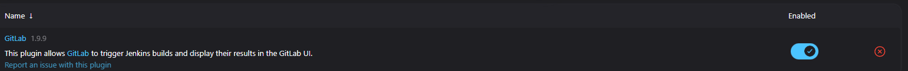
- Step 1: Create your admin access token
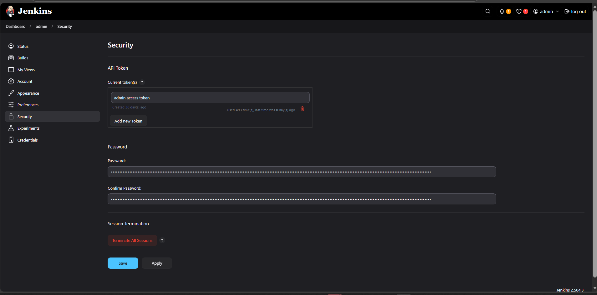
- Step 2: Go to your Project in GitLab then use the following url for GitLab. This url give the right credentials for GitLab to trigger build on Jenkins.
    ```
    https://<your-admin-user-name>:<admin-access-token>@<your-jenkins-hostname>/project/<folder-name>/<pipeline-name>
    ```
    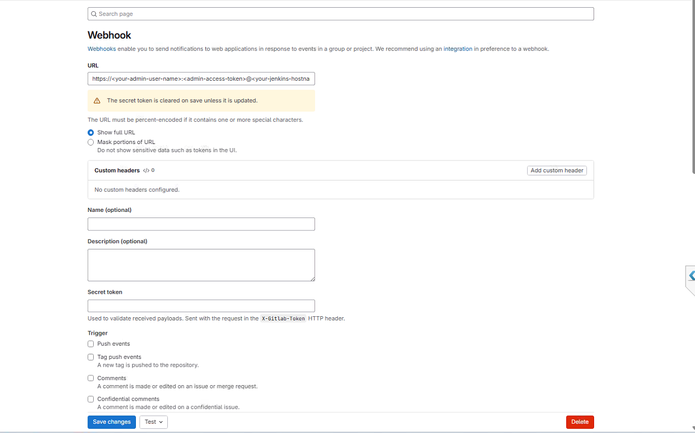
- Step 3: Set up Triggers in your pipeline to build based on specific events, like code changes or scheduled times,...
    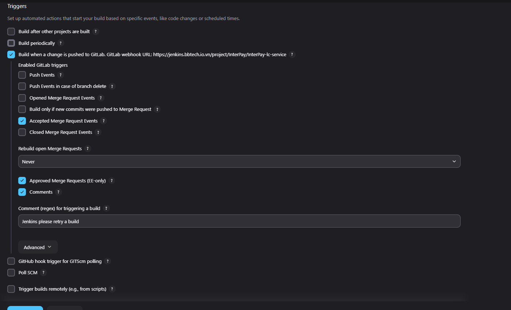

### Setting Notifications For Jenkins
- For Email Notification, install this plugins
    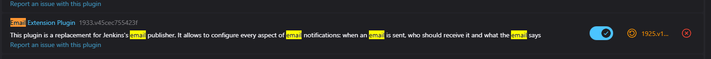
    - Set up Jenkins Location at System
        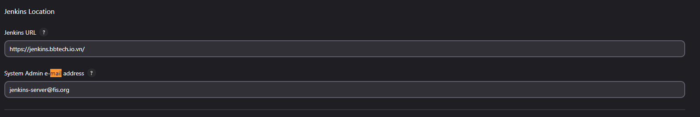
    - Set up Extended E-mail notification at System
        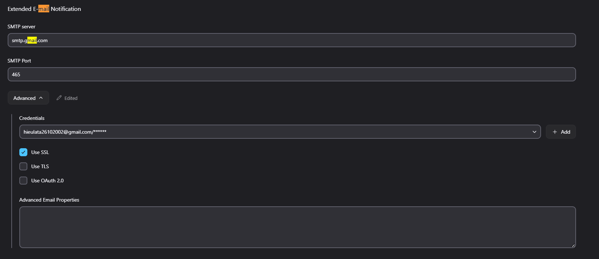
    - Create the Token for your gmail SMTP server at your [google-account](https://myaccount.google.com/apppasswords). The token is only showed up once, make sure to copy and store it.
        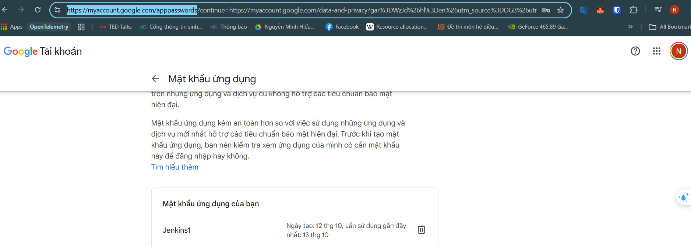
- For calling https-requests for notification, install this plugins
    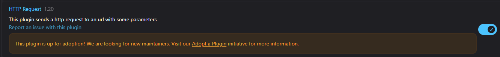
    - After installing that plugins you can use it with following commands:
        ```
        httpRequest(
            url: apiUrl,
            httpMode: method,
            customHeaders: [[name: 'Authorization', value: 'Bearer ' + PRIVATE_TOKEN]],
            ignoreSslErrors: true,
            acceptType: 'APPLICATION_JSON_UTF8',
            contentType: 'APPLICATION_JSON_UTF8',
            wrapAsMultipart: false,
            validResponseCodes: validResponseCodes,
            consoleLogResponseBody: this.enableDebugHttpRequest,
        )
        ```
### Docker Installation (Important to build image)
```
# Update and install prerequisites
sudo apt update -y
sudo apt install -y apt-transport-https ca-certificates curl software-properties-common

# Add Docker GPG key and repository
curl -fsSL https://download.docker.com/linux/ubuntu/gpg | \
sudo gpg --dearmor -o /usr/share/keyrings/docker-archive-keyring.gpg

echo \
  "deb [arch=$(dpkg --print-architecture) signed-by=/usr/share/keyrings/docker-archive-keyring.gpg] \
  https://download.docker.com/linux/ubuntu $(lsb_release -cs) stable" | \
  sudo tee /etc/apt/sources.list.d/docker.list > /dev/null

# Install Docker Engine, CLI, containerd, and Compose plugin
sudo apt update -y
sudo apt install -y docker-ce docker-ce-cli containerd.io docker-buildx-plugin docker-compose-plugin

# Verify installation
docker --version
docker compose version

# Allow Jenkins user to run Docker without sudo
sudo usermod -aG docker jenkins
sudo usermod -aG docker $USER

# Then restart Jenkins
sudo systemctl restart jenkins
```

## Code and Folder Breakdown
### src
- Purpose: Holds **Groovy** classes and packages - this is where you organize reusable logic.
- Details:
    - Code under src/ is complied and loaded as regular Groovy classes
    - You can use packages and imports (e.g import build.docker.*)
    - Each subfolder represents a namespace (package)
- Packages:
    - **vcs package**: This is version control package, including Git operations, branching strategies, creating meaningful tagging and commit automation.
    - **repository package**: Provides utilities for interacting with your repository like Harbor. This package is responsible for login to repository, generating repo name for your images.
    - **build package**: Contains all logic related to building, pushing, removing your unused/redundant Docker images and artifacts.
    - **deploy package**: Handle deployment logic to center argoCD by using argoCD CLI. This center argoCD will navigate the deployment to corresponding project, cluster, namespace,.. what we pre-defined in it.
    - **jenkins package**: Wraps Jenkins functionality. It abstracts direct interaction with the Jenkins pipeline, allowing you to write reusable methods to handle stages, environment, and common Jenkins operations. For example, the execute function runs your code in the Jenkins pipeline context, giving it access to all pipeline steps.
    - **quality package**: Contains logic and configuration for code quality, static analysis, and automated testing tools like SonarQube. Make sure to generate the API token using an Administrator account.
    - **utilities package**: Generic helper functions and tools that are used across multiple packages, such as Notification function.
    - **pipeline package**: Defines many pipeline types for different application types (backend, frontend, microservices, etc, ...). This is the combination of all above packages to create reusable, consistent pipeline templates that can be easily extended or customized per project.
### resources
- Purpose: Stores non-Groovy files used by your library - templates, yamls, configuration files, or static content.
- Details:
    - Accessed inside code using the helper function:
    ```
    libraryResource 'path/to/file'.
    For example: libraryResource("emailTemplate/jenkinsAlertTemplateEmail.html")
    ```
### vars
- Purpose: Defines global pipeline functions (utils.groovy) or variables (conf.groovy) accessible directly in any Jenkinsfile.
- Details:
    - Each .groovy file in vars/ becomes a global variable
    - These functions are automatically available without imports
- Notes:
    - If you create your object using init() (without extends Jenkins abstract), then the vars can easily be accessed using conf.<your-field-name>.key
    - If you create your class by extending Jenkins abstract, then you must add the prefix <jenkins-abstract-name>.conf. 
    For example: jenkins.conf.repository.registry.domain
    
    

## Dependencies
### Make sure you have your own:
- [Harbor registry](https://goharbor.io/)
- [Argocd](https://argo-cd.readthedocs.io/en/stable/cli_installation/)
- [Argocd CLI](https://argo-cd.readthedocs.io/en/stable/cli_installation/)
- [Git or Gitlab](https://docs.gitlab.com/)
- [Docker](https://www.docker.com/)

## Usage
### To use library in Jenkinsfile you need to import it first
```
@Library('jenkins-interpay-lib-main')_
import <folder-in-src>.* (example: import build.docker.* or import pipeline.be.*)
```
### To use CI pipeline you need to create new install and past Jenkins(this) to that instance. Then calling function in CI. Feel free to create more CI pipeline as you need.
```
ciPipeline = new CiPipeline(this)
ciPipeline.build("${DEPLOY_ENV}","${APP_NAME}","${SERVICE_NAME}")
```
### The following Jenkinsfile is an example to use lib for CI/CD backend:
```
@Library('jenkins-interpay-lib-main')_
import pipeline.be.*

def bePipeline

pipeline {
    agent any
    tools {
        jdk 'JDK21'
    }

    environment {
        SOURCE_URL = 'https://gitlab.fis.vn/bnkhcm.sw3/new-workflow/backend/auth-service.git'
        ARGO_REPO_URL = 'https://gitlab.fis.vn/bnkhcm.sw3/new-workflow/nonprod-cicd/cd-interpay.git'
        DEPLOY_ENV = 'dev'
        APP_NAME = 'interpay'
        SERVICE_NAME = 'auth-service'
        TIMEZONE = 'Asia/Ho_Chi_Minh'
    }

    stages {
        stage('Run Backend Pipeline') {
            steps {
                script {
                    bePipeline = new BePipeline(this)
                    bePipeline.run("${SOURCE_URL}", "${ARGO_REPO_URL}", "${DEPLOY_ENV}", "${APP_NAME}", "${SERVICE_NAME}", "${TIMEZONE}")
                }
            }
        }

        stage('Clean Up Workspace') {
            steps {
                deleteDir()
            }
        }
    }
}
```

### The following Jenkinsfile is an example to use lib for CI/CD frontend:
```
@Library('jenkins-interpay-lib-main')_
import pipeline.fe.FePipeline

def fePipeline

pipeline {
    agent any
    tools { nodejs "NodeJS" }

    environment {
        SOURCE_URL = 'https://gitlab.fis.vn/bnkhcm.sw3/new-workflow/frontend/webapp.git'
        ARGO_REPO_URL = 'https://gitlab.fis.vn/bnkhcm.sw3/new-workflow/nonprod-cicd/cd-interpay.git'
        DEPLOY_ENV = 'dev'
        APP_NAME = 'interpay'
        SERVICE_NAME = 'webapp'
        TIMEZONE = 'Asia/Ho_Chi_Minh'
    }

    stages {
        stage('Run Frontend Pipeline') {
            steps {
                script {
                    fePipeline = new FePipeline(this)
                    fePipeline.run("${SOURCE_URL}", "${ARGO_REPO_URL}", "${DEPLOY_ENV}", "${APP_NAME}", "${SERVICE_NAME}", "${TIMEZONE}")
                }
            }
        }

        stage('Clean Up Workspace') {
            steps {
                deleteDir()
            }
        }
    }
}
```

### Modify the conf.groovy to add more configuration as you need. For example edit
- envConfigMap
- credentials
- repository
- gitConfig
