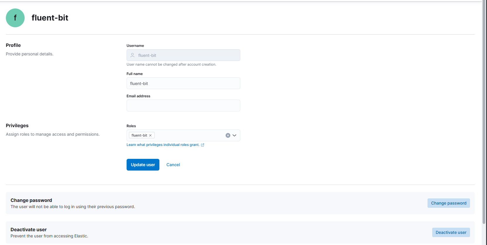
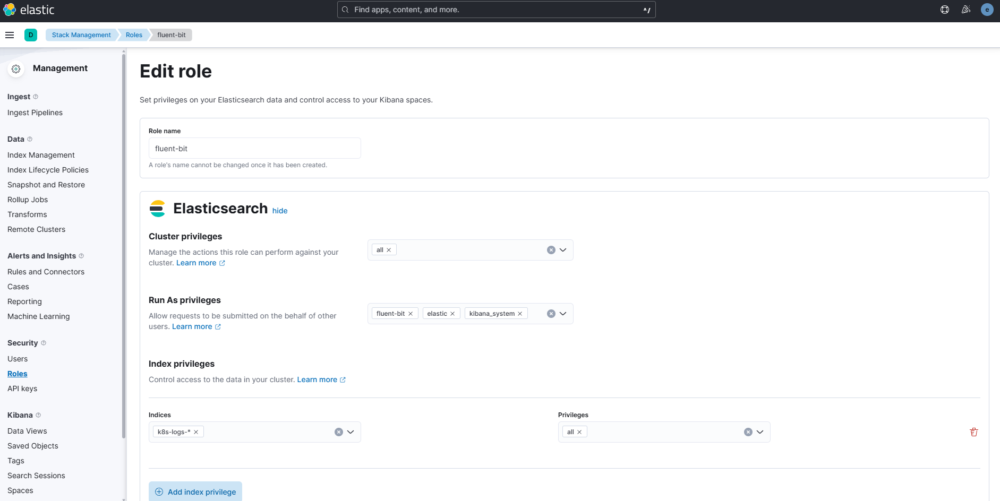

# Set up Kibana with Elastic Search

# Getting started

To make it easy for you to get started with this project, here's a list of recommended next steps.

# Contents
- [Dependencies](#dependencies)
- [Installation](#installation)

## Dependencies
### Make sure to install [Tailscale](https://tailscale.com/download) on all VM (Machine)
Tailscale will make your IP permanently event if you restart the machine.

### Ingress controller is installed on cluster

### Make sure to copy the secret cert elasticsearch-master-certs and credential elasticsearchCredentialSecret to name space where kibana is installed on.

## Installation

There are 7 steps to set up Cluster Elasticsearch.

1. Set up Kibana with Elastic :
    - elasticsearchHosts : 
        - If Kibana and ElasticSearch are in the same cluster -> use the service name of elastic with port 9200 (https://elasticsearch-master:9200)
        - Kibana and ElasticSearch are not in the same cluster -> use the domain name of elasticsearch-master (https://<your-elastic-master-domainj>)
    - elasticsearchCertificateSecret: The cert created by master node (elasticsearch-master-certs)
    - elasticsearchCertificateAuthoritiesFile: ca.crt
    - elasticsearchCredentialSecret: Credential when connect to elasticsearch (elasticsearch-master-credentials)

2. Set up Kibana Config
    ```
    kibanaConfig:
    kibana.yml: |
        elasticsearch.hosts: [ "https://elasticsearch-master:9200" ]
        status.allowAnonymous: true # Allow health check for http
    ```

3. Set up Ingress for Kibana

    **Note**: Create the secret tls for your domain
    ```
    ingress:
    enabled: true
    className: "nginx"
    pathtype: ImplementationSpecific
    annotations:
        kubernetes.io/ingress.class: nginx
        nginx.ingress.kubernetes.io/ssl-redirect: "true"
        nginx.ingress.kubernetes.io/force-ssl-redirect: "true"
    hosts:
        - host: kibana.bbtech.io.vn
        paths:
            - path: /
    tls:
    - secretName: bbtech-tls
        hosts:
        - kibana.bbtech.io.vn
    ```
4. Feel Free to update the readinessProbe

5. Install Kibana
    ```
    helm install kibana elastic/kibana -f kibana-values.yaml -n elastic
    ```
    
6. Create user and role fluent-bit for sending logs. Make sure to change password
    

    

7. Create Log Rotation for each index
- Navigate to Dev-Tool of Kibana
    ```
    PUT _ilm/policy/k8s-log-delete-policy
    {
        "policy": {
            "phases": {
            "hot": {
                "actions": {}
            },
            "delete": {
                "min_age": "7d",
                "actions": {
                "delete": {}
                }
            }
            }
        }
    }
    
    # Used this if index does not exist
    PUT _index_template/k8s-log-template
    {
        "index_patterns": ["k8s-log-*"],
        "template": {
            "settings": {
            "index.lifecycle.name": "k8s-log-delete-policy"
            }
        }
    }

    # Use This if index exists
    PUT <your_index>/_settings
    {
        "settings": {
            "index.lifecycle.name": "k8s-log-delete-policy"
        }
    }
    ```

- Check if the index.lifecycle.name is set up
    ```
    GET k8s-logs-*/_settings?pretty
    ```
